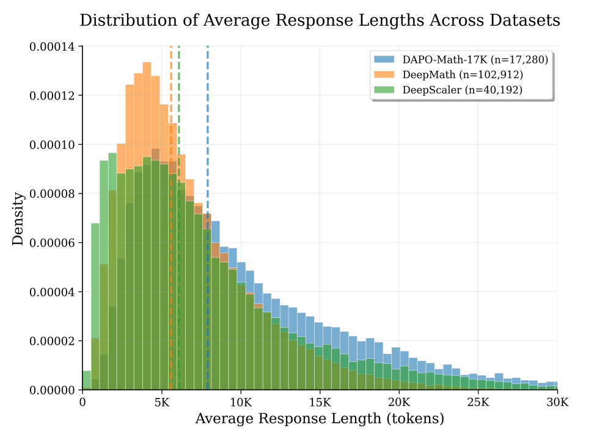
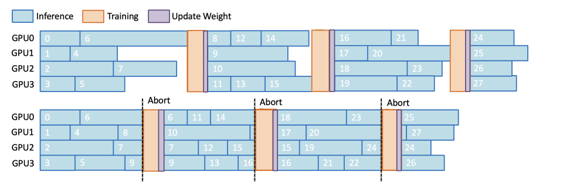
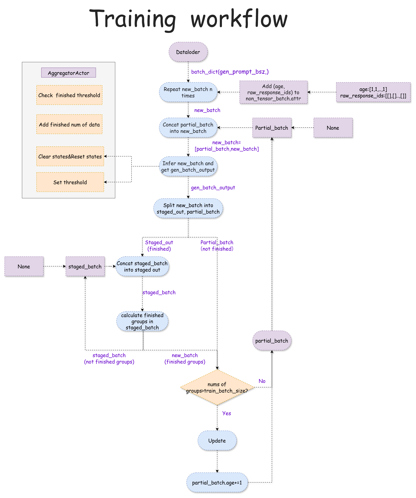
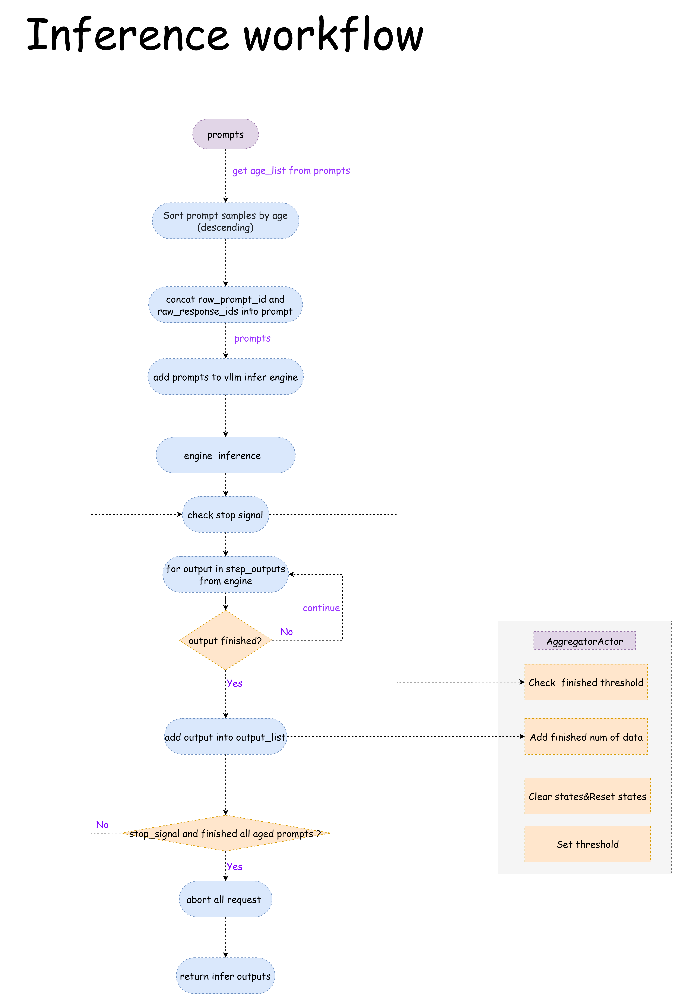

# Motivation

During the reinforcement learning training process, as the model performance continues to improve, the output response sequences also keep lengthening — especially in the slow thinking mode, the sequence length can reach tens of thousands of tokens, which leads to a continuous increase in the proportion of time consumed in the inference phase.
Meanwhile, we have statistically analyzed the distribution of response output lengths (see the figure below) and found that there is a significant long-tail effect: although a small number of samples account for an extremely low proportion, their sequence lengths far exceed the average level.

# Method

We can adopt the method of early truncation to address the long-tail problem in the inference phase and improve inference performance. The specific approach is illustrated in the figure below: when a sample's response is excessively long, it is truncated early, and the remaining part after truncation is incorporated into the next inference process, thereby reducing unnecessary waiting time.

# Proposed Design

Based on the aforementioned approach, we have designed and implemented a complete partial rollout workflow. Below, we split this workflow into the Training Workflow and Inference Workflow for detailed elaboration.
In the Training Workflow, we first add two fields (age and raw_response_ids) to the data attributes: age records the aging rounds of data samples, while raw_response_ids stores the partial responses that were left unfinished in the previous inference round. Additionally, we introduce the AggregatorActor component, whose core responsibility is to aggregate samples that have completed inference across all DP (Data Parallelism) groups. When the cumulative number of completed inference samples reaches the preset threshold, the AggregatorActor sends an inference completion signal to all worker nodes. Upon receiving the signal, each worker immediately terminates the current inference process, saves the unfinished partial responses to the raw_response_ids field, and these partial responses will continue to be processed in subsequent rounds.

We first filter out the incompletely inferred parts from all samples to form a partial_batch — the unfinished responses of these samples are appended to the original prompts for subsequent rollout inference (i.e., the partial rollout mechanism).
For the fully inferred samples (denoted as staged_out), due to the mechanism of performing n rounds of inference on one sample, we count the number of groups that have completed processing staged_out samples: if the number of completed groups exceeds the set value of train_batchsize, we terminate the current inference process and proceed to the training update phase (update); otherwise, we combine new samples with the partial_batch to initiate the next round of inference.

In the inference workflow, we first sort the samples corresponding to the prompts to be inferred by the age attribute: samples with a larger age value are ranked higher and prioritized for inference in the inference engine. After inference starts, we traverse the output results of the inference engine: if a sample completes inference, it is stored in output_list, and the count of samples that have completed inference is accumulated in the AggregatorActor component. We then check if the cumulative count meets the preset threshold. If the threshold is reached, the AggregatorActor sends an inference termination signal to all worker nodes, immediately terminating the current inference process, and finally returns both the samples that have completed inference and those that haven't.

Referenced part of the implementation logic of this PR [#1826](https://github.com/volcengine/verl/pull/1826/files) and related paper https://arxiv.org/pdf/2509.18521.